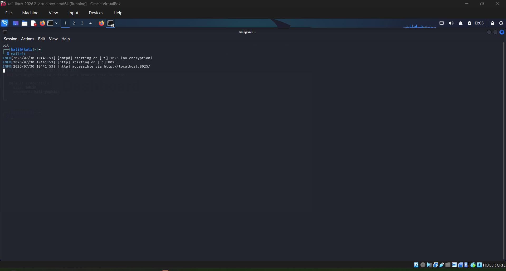
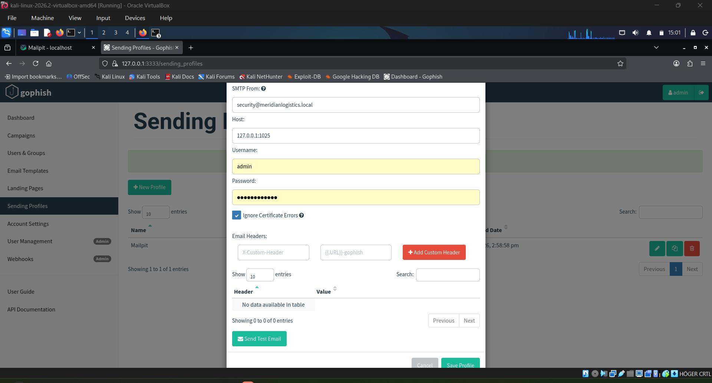
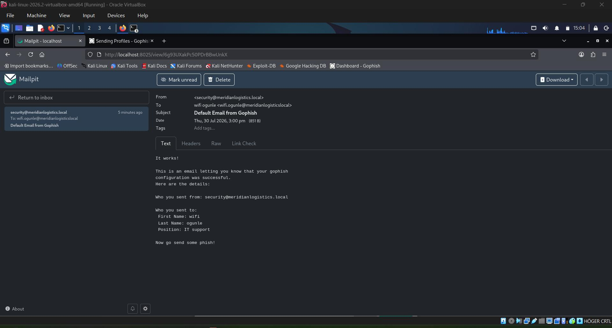
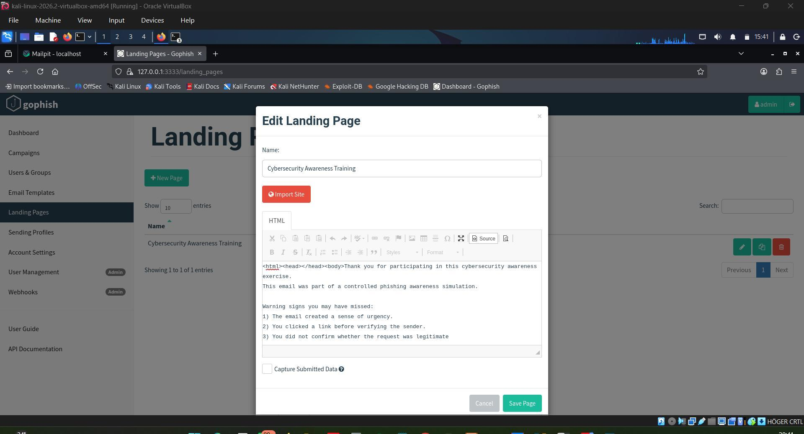
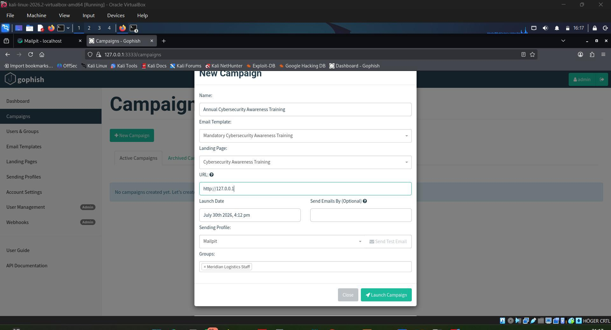

# Phishing Awareness Training Kit

A safe, lab-based phishing-awareness training kit built to help organisations measure phishing susceptibility, reinforce safe email habits, and evaluate awareness outcomes without collecting credentials or contacting real users.

> **Ethical use:** This project is for authorised training and controlled simulations only. Do not use it to target real people, collect credentials, or send mail outside an approved scope.

## Overview

Phishing remains a major cause of financial loss and data compromise. This project addresses the human side of that risk by creating a repeatable awareness exercise: staff receive a simulated phishing email, anyone who follows its link sees an educational page instead of a credential prompt, and the organisation reviews aggregate results to improve training.

The example organisation used throughout the project, **Meridian Logistics Ltd.**, and the `meridianlogistics.local` domain are fictional and used for illustration only.

## Objectives

- Deliver baseline phishing-awareness guidance.
- Configure a controlled GoPhish and Mailpit lab.
- Create a simulated awareness email and educational landing page.
- Run a safe, authorised simulation campaign.
- Evaluate delivery, click, and reporting metrics.
- Recommend technical and administrative improvements.

## Lab Environment

### Requirements

- **Hardware:** Minimum 8 GB RAM and 40 GB of storage
- **Operating system:** Kali Linux in VirtualBox
- **Tools:** GoPhish, Mailpit, Firefox, and Microsoft Word or LibreOffice for reporting

### Components

| Component | Purpose |
| --- | --- |
| GoPhish | Builds the email template, landing page, target group, and campaign; records campaign events. |
| Mailpit | Captures outbound messages locally so email never leaves the lab. |
| Educational landing page | Explains the warning signs and reporting process after a participant clicks the simulated link. |

## Training Content

The pre-campaign briefing covers:

- What phishing is and why it matters in the workplace.
- Common warning signs: spoofed senders, urgent language, mismatched or shortened links, unexpected attachments, and generic greetings.
- Safe habits: verify requests through another channel, hover over links, and never enter credentials from an email link.
- How and where to report a suspected phishing email.

### Just-in-Time Education

The campaign landing page is educational only. It explains the red flags in the message and reinforces the reporting procedure; it does **not** request or capture credentials.

## Implementation Summary

1. Start GoPhish and sign in at `https://127.0.0.1:3333`.
2. Start Mailpit and open `http://127.0.0.1:8025`.
3. Add a local SMTP sending profile, using `127.0.0.1:1025` with no authentication.
4. Create an awareness email template with a GoPhish tracking link such as `{{.URL}}`.
5. Create an educational landing page and leave credential capture disabled.
6. Create a fictional test-user group.
7. Launch an authorised campaign and verify delivery in Mailpit.
8. Review campaign results in GoPhish and share a non-punitive, aggregate debrief.

## Lab Screenshots

The following screenshots document the safe lab workflow. They use local infrastructure and fictional training data only.

### 1. Start Mailpit



### 2. Configure the Local Sending Profile



### 3. Create the Awareness Email Template



### 4. Build the Educational Landing Page



### 5. Configure the Campaign



## Example Email Template

**Subject:** Mandatory Cybersecurity Awareness Training

```html
Hello,

As part of our annual security awareness programme, all staff are required to complete this short training exercise.

<a href="{{.URL}}">Start Awareness Training</a>

Thank you,
IT Security Team
```

## Assessment Method

The sample campaign sent one simulated awareness email to 12 fictional test accounts spanning several departments. Mailpit kept all mail inside the lab, while GoPhish tracked delivery, link clicks, and phishing reports. The landing page was non-credential-harvesting throughout.

## Sample Results

| Metric | Result |
| --- | ---: |
| Emails sent | 12 |
| Emails delivered | 12 (100%) |
| Link clicks | 7 (58.3%) |
| Reported as phishing | 4 (33.3%) |
| No action | 1 (8.3%) |
| Landing-page visits | 7 |
| Campaign duration | 85.9 minutes |

### Key Findings

- The 58.3% click rate exceeded the 33.3% report rate, showing a clear awareness gap in the sample.
- Susceptibility was present across both technical and non-technical roles.
- Some participants responded quickly, while others did not notice the message until late in the exercise.
- The findings support regular, non-punitive awareness reinforcement and measurement.

## Recommendations

### Technical Controls

- Implement SPF, DKIM, and DMARC.
- Require multi-factor authentication (MFA).
- Use a secure email gateway.
- Keep systems and software patched.

### Administrative Controls

- Run phishing-awareness exercises quarterly.
- Provide regular, practical user training.
- Establish a clear phishing-reporting process.
- Review aggregate results after each campaign and improve the training accordingly.

## Safe-Lab Safeguards

- All target accounts are fictional test accounts on a local lab domain.
- The landing page contains education only and never captures credentials.
- Mailpit intercepts all email locally; messages are not delivered to the public internet.
- Any exercise involving real staff requires documented authorisation, agreed scope and consent boundaries.
- Results should be aggregated and handled non-punitively.

## Deliverables

- Campaign assessment report: objectives, method, results, and interpretation.
- Safe-lab evidence showing the controlled, educational design.
- Technical and administrative remediation recommendations.

## License and Responsible Use

Use this kit only for legitimate security-awareness training with appropriate authorisation. Respect privacy, follow organisational policies, and comply with applicable laws and regulations.
